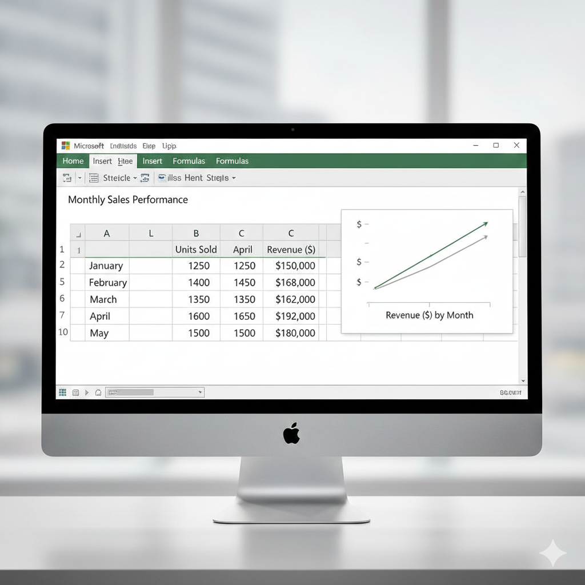

## 10.1. Lectura de archivos

En la práctica, la mayoría de los datos que analizarás no serán creados directamente dentro de R, sino que **estarán almacenados en archivos externos** como **archivos de texto** (.txt), **valores separados por comas** (.csv) o **hojas de cálculo de Excel** (.xls, .xlsx). Para trabajar con ellos, el primer paso es acceder a esa información y cargarla en R para convertirla en un data frame.

### 10.1.1. Resumen de Funciones para Leer/Importar Datos

+------------------------------------+----------------+----------------------------------------------------------+
| Extensión (tipo de archivo)        | Función en R   | ¿Por qué usarla?                                         |
+:===================================+:===============+:=========================================================+
| **`.txt`**                         | `read.table()` | Es muy flexible con espacios y tabuladores.              |
|                                    |                |                                                          |
| Archivo de texto                   |                |                                                          |
+------------------------------------+----------------+----------------------------------------------------------+
| **`.csv`**                         | `read.csv()`   | Configurada por defecto para separar por comas.          |
|                                    |                |                                                          |
| **C**omma **S**eparated **V**alues |                |                                                          |
+------------------------------------+----------------+----------------------------------------------------------+
| **`.xlsx`**                        | `read_excel()` | Requiere el paquete `readxl` (maneja archivos binarios). |
|                                    |                |                                                          |
| Archio de Excel                    |                |                                                          |
+------------------------------------+----------------+----------------------------------------------------------+

------------------------------------------------------------------------

### 10.1.2. Guía Rápida de Importación

Para importar datos correctamente, asegúrate de que el archivo esté en la misma carpeta que tu proyecto o indica la ruta completa.

### **Importar archivos de texto (.txt)** `read.table("archivo.txt")`

Un archivo "table" o de texto es un archivo plano que puedes abrir con el Bloc de Notas.

Ejemplo de estructura de un archivo .txt:

`Nombre Edad Sueldo`

`Juan 25 1500`

`Ana 30 2200`

Nota: Normalmente los archivos .txt están separados por un **espacio**. Si usas **tabulaciones** en vez de espacios, añade: `sep = "\t"`

```{r guia_importacion, eval=FALSE}


misdatos_txt <- read.table("empleados.txt", header = TRUE, sep = "\t")

```

Los argumentos más utilizados de `read.table`:

-   **`header`**: indica si el fichero tiene cabecera (`TRUE`/`FALSE`).
-   **`sep`**: carácter separador de columnas (por defecto espacio en blanco).
-   **`dec`**: carácter decimal (por defecto `"."`).

### **Importar archivos .csv** `read.csv("archivo.csv")`

Un archivo .csv es un archivo de tevto separado por comas o por punto y comas. Se recomienda exportar desde Excel a CSV antes de leer en R, ya que son archivos que pesan y ocupan menos.

Ejemplo de estructura de un archivo .txt:

**Nombre,Edad,Departamento**
Juan,25,Ventas
Ana,30,Marketing
Luis,45,Ingeniería

`read.csv` es más directo porque asume que el separador es una coma. Utilizar `read.csv2` si el archivo fue guardado desde un Excel en español

```{r, eval=FALSE}

#misdatos_csv <- read.csv("empleados.csv", header = TRUE)
```

Otras funciones disponibles:

```{r read-delim, eval=FALSE}
read.delim(file,  header = TRUE, sep = "\t", dec = ".")
read.delim2(file, header = TRUE, sep = "\t", dec = ",")
```

### **Importar archivos de Excel (.xls o .xlxs)** `read.excel("archivo.xls")`

Un archivo .xls es un archivo creado con Excel.

{width="400"}

Requiere instalar el paquete: `install.packages("readxl")`

```{r readexcel , eval= FALSE}
# Requiere instalar el paquete: install.packages("readxl")
library(readxl)
datos_excel <- read_excel("empleados.xlsx")
```

> **Consejo Pro:** Si vas a compartir tu código, coloca `install.packages("readxl")` como comentario al inicio. Esto ayudará a otros usuarios a saber qué dependencias necesitan instalar antes de ejecutar tu script.

Otro ejemplo:

```{r read-csv, eval=FALSE}
# datos <- read.table("Vigo2017.csv", header = TRUE, sep = ";", dec = ",")
head(datos)
summary(datos)
```

### Tratamiento de valores perdidos

En algunos ficheros los valores ausentes están codificados (p. ej., `-9999`). Se puede indicar con el argumento `na.strings`:

```{r na-strings, eval=FALSE}
# datos <- read.csv2("Vigo2017.csv", na.strings = "-9999")
head(datos)
```

## 10.2. Exportar datos

```{r write-table, eval=FALSE}
tipo     <- c("A", "B", "C")
longitud <- c(120.34, 99.45, 115.67)
datos    <- data.frame(tipo, longitud)

write.table(datos, file = "datosPractica2.txt")
write.csv2(datos,  file = "datosPractica2.csv")
```
