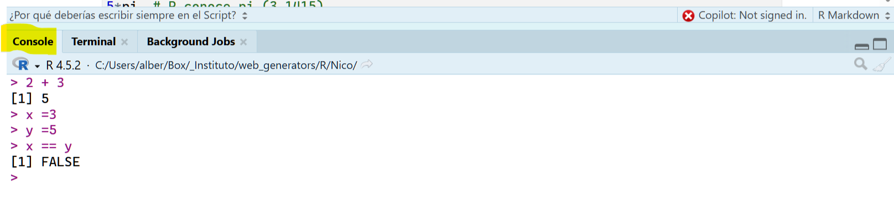
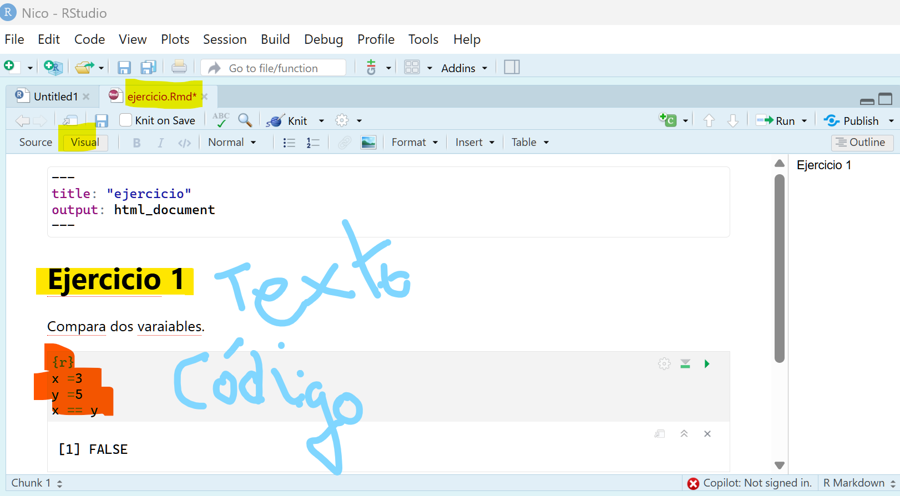

```{r setup, include=FALSE}
knitr::opts_chunk$set(echo = TRUE, eval = TRUE)
```

# 2. Archivos y ventanas de RStudio

R es un lenguaje de programación y un entorno de software utilizado principalmente para el **análisis estadístico** y la **visualización de datos**. Sin embargo, también se puede utilizar como una calculadora avanzada.

## 2.1 Tipos de archivos

### 2.1.1. Archivos `.R` (Scripts puros)

Es un archivo de **código plano**.

-   **Contenido:** Solo puedes escribir código de R. Si escribes texto normal (como una frase), R te dará un error a menos que lo pongas detrás de un símbolo `#` (comentario).
-   **Uso:** Ideal para crear funciones, limpiar datos a gran escala o automatizar procesos que no necesitan explicaciones textuales.
-   **Ejecución:** Ejecutas línea por línea o bloques de código seleccionados con `Ctrl + Enter`.

### 2.1.2. Archivos `.Rmd` (R Markdown)

Es un archivo de **documento dinámico**.

-   **Contenido:** Es una mezcla de **texto enriquecido** (Markdown) y **bloques de código** (Chunks). Puedes escribir un informe completo, explicar qué hace tu código y mostrar los resultados (gráficos, tablas) en el mismo sitio.
-   **Uso:** Es el estándar de oro para reportes, tareas, artículos científicos o presentaciones.
-   **Ejecución:** Se "compila" entero mediante el botón **Knit**. El resultado final no es solo código, sino un documento terminado en formato HTML, PDF o Word.

------------------------------------------------------------------------

### 2.1.3. Cómo los diferencia RStudio?

| Característica | Archivo `.R` | Archivo `.Rmd` |
|----|----|----|
| **Idioma principal** | Código R | Markdown (texto) + bloques de código |
| **Para escribir texto** | Necesitas `#` en cada línea | Escribes libremente sin símbolos |
| **Resultado final** | El código ejecutado | Un documento legible (reporte) |
| **Botón clave** | **Source** (ejecuta todo) | **Knit** (crea el documento) |

------------------------------------------------------------------------

> Un consejo práctico:

Si estás empezando, te recomiendo usar **`.Rmd`** la mayor parte del tiempo. **¿Por qué?** Porque al escribir código, a menudo olvidamos qué hacíamos hace dos semanas. En un `.Rmd` puedes escribir:

> *"Este bloque sirve para calcular el promedio de los empleados de la empresa..."* ...y debajo poner el código. Eso te ayuda a ti mismo (y a otros) a entender tu propio trabajo sin tener que descifrar cada línea de código.

¿Te sientes más cómodo escribiendo en un formato de "documento" (`.Rmd`) o prefieres la simplicidad de un script (`.R`)?

Abre R o RStudio. Deberías ver una consola donde puedes ingresar comandos de R.

## 2.3 La ventana de consola y la ventana de script

### 2.3.1. La ventana Consola

La **consola** es el motor operativo de RStudio, diseñado exclusivamente para la **ejecución dinámica y temporal** de código. Aunque es la herramienta donde observas el resultado de tus operaciones, es un **error tratarla como un lugar de almacenamiento**.

La consola funciona bajo una lógica de "pizarra blanca": **está hecha para probar ideas, verificar funciones rápidamente, detectar errores de forma inmediata, o incluso, para instalar paquetes**. Sin embargo, carece de una función de guardado automático para el usuario. **Al cerrar RStudio, todo el contenido de la consola se pierde de manera definitiva**.



En definitival podemos considerar la consola como una **calculadora rápida** de R que ejecuta línea a línea al pulsar **CTRL + ENTER**.

```{r consola, echo=TRUE}

# La consola puede funcionar como una pequeña calculadora

2 + 3

sqrt(16)

1 + 2 * 4

(1 + 2) * 4

3 + 5; 3 + 6  # varias órdenes se separan por ;

5*pi  # R conoce pi (3.1415)
```

### 2.3.2. La ventana de Script

La ventana de Script es la ventana/editor más versátil de RStudio. Es el "taller" de RStudio. Mientras que :

-   la \*Consola\*\* es donde pruebas cosas rápidas y ves los resultados,

-   el \*Script\*\* es donde escribes tus programas, guardas tu código y lo haces reproducible.

-   

Si estás trabajando en RMarkdown (.Rmd), tu ventana de script es la que tiene el fondo blanco donde escribes el texto y los bloques de código \`\`\`{r}.

Los archivos guardados en esta ventana tienen la extenxión .rmd y combinan bloques de texto con bloques de código.

### ¿Por qué deberías escribir siempre en el Script?

\*\*Persistencia\*\*: Si cierras RStudio, todo lo que escribiste en la Consola se pierde. Lo que guardas en un archivo de Script (.R) o RMarkdown (.Rmd) se queda ahí para siempre.

\*\*Edición\*\*: Es mucho más fácil corregir un error de dedo en un script que intentar editar una línea que ya ejecutaste en la consola.

\*\*Reproducibilidad\*\*: Puedes compartir tu archivo .Rmd con otra persona, y ellos podrán ejecutarlo y obtener los mismos resultados que tú.

Los ficheros script de R se pueden guardar utilizando **Archivo → Guardar como...** y eligiendo a continuación la ubicación que interesa en el disco duro del ordenador.

Por defecto R utiliza una carpeta de trabajo donde guardará la información.

```{r directorio-trabajo, eval=FALSE}
getwd()  # devuelve la carpeta de trabajo

# Cambiar la carpeta de trabajo
setwd("/ruta/a/tu/carpeta")

# Ejemplo en Windows
setwd("c:/")
```

------------------------------------------------------------------------

# Funciones y Operadores en R

## Funciones principales

| Función                       | Código en R      |
|-------------------------------|------------------|
| Raíz cuadrada de x            | `sqrt(x)`        |
| Exponencial de x              | `exp(x)`         |
| Logaritmo neperiano           | `log(x)`         |
| Nº de elementos de un vector  | `length(x)`      |
| Suma los elementos del vector | `sum(x)`         |
| Seno de x                     | `sin(x)`         |
| Coseno de x                   | `cos(x)`         |
| Tangente de x                 | `tan(x)`         |
| Media                         | `mean(x)`        |
| Desviación típica             | `sd(x)`          |
| Varianza                      | `var(x)`         |
| Mediana                       | `median(x)`      |
| Quantiles                     | `quantile(x, p)` |
| Máximo y Mínimo               | `range(x)`       |
| Ordenación                    | `sort(x)`        |
| Resumen estadístico           | `summary(x)`     |

Ejemplos:

```{r}
x = 16
sqrt(x)
exp(x)

```

```{mivector = c(3,6,2,7)}
length(mivector)
mean(mivector)
```

## Operadores en R

### Aritméticos

| Operador | Descripción     |
|----------|-----------------|
| `+`      | Suma            |
| `-`      | Resta           |
| `*`      | Multiplicación  |
| `/`      | División        |
| `^`      | Potencia        |
| `%/%`    | División entera |

### Comparativos

| Operador | Descripción   |
|----------|---------------|
| `==`     | Igualdad      |
| `!=`     | Diferente de  |
| `<`      | Menor que     |
| `>`      | Mayor que     |
| `<=`     | Menor o igual |
| `>=`     | Mayor o igual |

### Lógicos

| Operador | Descripción |
|----------|-------------|
| `&`      | Y lógico    |
| `|`      | O lógico    |
| `!`      | No lógico   |

## Ejemplos con operadores

```{r operadores-ejemplos, echo=TRUE}
datos <- c(1, 5, 10, 3)

min(datos)
max(datos)
which.min(datos)
which.max(datos)
range(datos)
mean(datos)
median(datos)
sum(datos)

2 * datos

datos == 5
datos == 5 & datos == 1
datos == 5 | datos == 1

3 < 2
2 < 3 & 4 < 1
2 < 3 | 4 < 1
```

## Asignación de variables

```{r asignacion}
resultado_suma           <- 5 + 3
resultado_resta          <- 10 - 2
resultado_multiplicacion <- 4 * 6
resultado_division       <- 20 / 5
resultado_potenciacion   <- 2^3

print(resultado_suma)

```

## Tipos de datos básicos

```{r tipos-datos}
x1 <- TRUE                                # logical
x2 <- 3L                                  # integer
x3 <- 3.4                                 # numeric
x5 <- "Esto es una cadena de caracteres"  # character

ls.str()

# Conversiones
as.integer(x1)
as.integer(x3)

# Comprobaciones
is.integer(x1)
is.logical(x1)
is.integer(x2)

```
