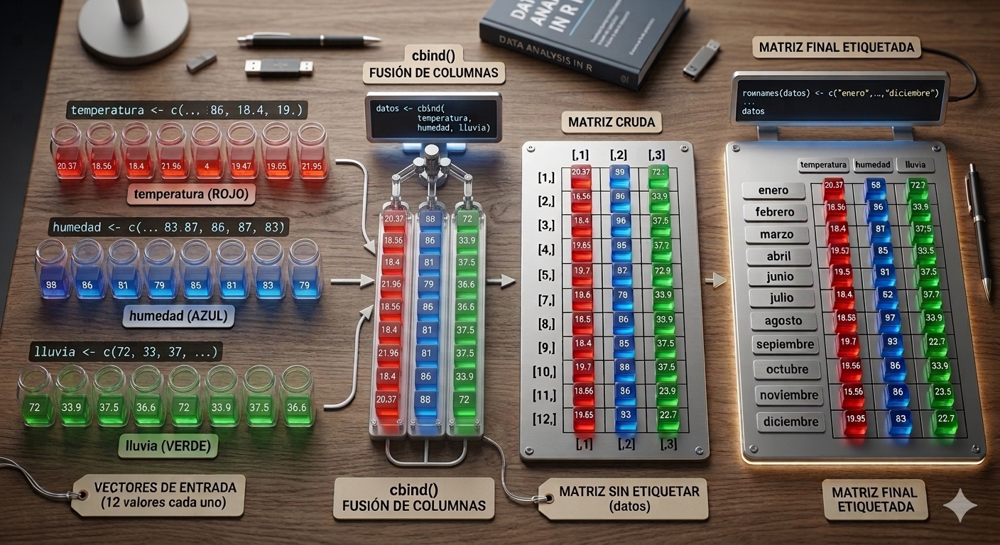

# 6. Matrices: los datos en forma de rectángulo

Una matriz es una estructura de datos **bidimensional** que organiza elementos del mismo tipo (como números, caracteres o valores lógicos) en una cuadrícula de **filas** (nrows) y **columnas** (ncol).

Puedes visualizarla como una tabla matemática donde cada elemento es identificado por dos coordenadas o índices: la posición de su fila y la posición de su columna.

**Puntos clave**:

-   Homogeneidad: Todos los datos dentro de la matriz deben ser del mismo tipo (por ejemplo, no puedes mezclar texto y números en una misma matriz).

-   Bidimensionalidad: A diferencia de un vector (que solo tiene una dimensión), la matriz requiere dos índices para acceder a un valor: [i, j], donde i es la fila y j es la columna.


## 6.1. Crear  elementos de una matriz

La función principal es `matrix()`. Debes especificar los datos, el número de filas (nrow) o columnas (ncol).

Por defecto, las matrices se completan primero la columna 1, después la columna 2, columna 3, ....

```{r matrices}
# Crear una matriz 3x3 con elementos del 1 al 9
matrix(1:9, nrow = 3, ncol = 3)
```

```{r}
# Creamos una matriz de 4 filas y 34 columnas con datos selccionados por nosootros (van dentro de un vector)
matrix(c(14, 22, 43, 4, 51, 26, 36, 12, 36, 76, 27, 56), nrow = 3, ncol = 4)

```

Las matrices creadas suelen guardarse en una variable es fundamental porque sino se hace la matriz se mostrará en la consola y, a continuación, desaparecerá; no podrás volver a usarla.

```{r}
# Guardamos la matriz en la variable mimatriz

mimatriz <-matrix(20:25, nrow= 2, ncol=3)
print(mimatriz)

```

```{r}
#Reutilizamos la variable mimatriz

doble_mimatriz <- 2*mimatriz
print(doble_mimatriz)
```

## 6.2. Acceder a elementos de una matriz

Para acceder a un elemento específico dentro de una matriz en R, utilizamos el operador de **corchetes `[ ]`**, indicando las coordenadas mediante la notación `[fila, columna]`.

Aquí tienes cómo funciona:

### Sintaxis básica

`nombre_de_la_matriz[fila, columna]`

```{r matrices1}

# Acceder al elemento en la segunda fila y tercera columna

mi_matriz = matrix(1:9, nrow = 3,  ncol = 3)
print(mi_matriz)
elemento <- mi_matriz[2, 3]
print("**---------------------**")
print(elemento) # Solución: 8
```

Para accder a los datos de una fila completa:

```{r}
x <- matrix(1:6, 2, 3)
x

```

```{r}
x[2, ]    # segunda fila
x[, 2]    # segunda columna
x[1, 1:2] # primera fila, pero solo columnas 1ª y 2ª
```

## 6.3. Otras formas de crear matrices

**Ejemplo: Crear una matriz 2x4**

```{r matrices2}

matrix(1:8, nr = 2, nc = 4)
```

```{r matrices3}

matrix(1:8, 2, 4)               # por columnas (como Fortran)

```

En el siguiente caso la matriz rellena primero la fila 1, después la fila 2 ...

```{r matrices4}

matrix(1:8, 2, 4, byrow = TRUE) # por filas
```

## 6.4. Operaciones con matrices

```{r operaciones-matrices, eval=TRUE}
# Crear dos matrices
matriz_a <- matrix(1:4, nrow = 2)
matriz_b <- matrix(5:8, nrow = 2)


```

```{r}
print(matriz_a)
```

```{r}
print(matriz_b)
```

**Suma de matrices: +**

```{r}
# Sumar las matrices
resultado_suma <- matriz_a + matriz_b
print(resultado_suma)
```

**Producto matricial: %\*%**

```{r}
# Multiplicar las matrices (producto matricial)
resultado_multiplicacion <- matriz_a %*% matriz_b

print(resultado_multiplicacion)
```

**Transpuesta: t**

```{r}
# Transpuesta
mi_matriz <- matrix(1:6, nrow = 2)
print(mi_matriz)
matriz_transpuesta <- t(mi_matriz)
print(matriz_transpuesta)
```

## 6.5. Funciones para matrices

| Función                     | Descripción                                |
|-----------------------------|--------------------------------------------|
| `dim()`, `nrow()`, `ncol()` | Número de filas y/o columnas               |
| `diag()`                    | Diagonal de una matriz                     |
| `*`                         | Multiplicación elemento a elemento         |
| `%*%`                       | Multiplicación matricial                   |
| `cbind()`, `rbind()`        | Encadenamiento de columnas o filas         |
| `t()`                       | Transpuesta de una matriz                  |
| `solve(A)`                  | Inversa de la matriz A                     |
| `solve(A, b)`               | Solución del sistema de ecuaciones         |
| `qr()`                      | Descomposición QR                          |
| `eigen()`                   | Autovalores y autovectores                 |
| `svd()`                     | Descomposición en valores singulares (SVD) |

## 6.6. Crear matrices a partir de varios vectores/listas

Este código es un ejemplo excelente de cómo pasar de datos "sueltos" (vectores) a una estructura de datos organizada (una matriz) y, lo más importante, cómo añadirle etiquetas (nombres) para que sea mucho más fácil de leer y entender.

En resumen:

1.  **Preparación de datos:** Se crean tres vectores (`temperatura`, `humedad`, `lluvia`) con 12 valores cada uno. Es crucial que tengan la misma longitud.

2.  **Unión por columnas (`cbind()`):** Se usa la función `cbind()` para pegar los vectores uno al lado del otro horizontalmente, creando una matriz de 12 filas y 3 columnas. Las columnas reciben automáticamente los nombres de los vectores originales.

3.  **Etiquetado de filas (`rownames()`):** Se asigna un vector con los nombres de los 12 meses a las filas de la matriz usando `rownames()`. Esto transforma los índices numéricos en etiquetas legibles, facilitando la comprensión y el acceso a los datos.

4.  **Verificación de dimensiones:** Se usan funciones como `dim()`, `nrow()` o `ncol()` para confirmar que la estructura final es la esperada (12x3).



```{r nombres-matrices}
temperatura <- c(20.37, 18.56, 18.4, 21.96, 29.53, 28.16, 36.38, 36.62, 40.03, 27.59, 22.15, 19.85)
humedad     <- c(88, 86, 81, 79, 80, 78, 71, 69, 78, 82, 85, 83)
lluvia      <- c(72, 33.9, 37.5, 36.6, 31, 16.6, 1.2, 6.8,36.8, 30.8, 38.5, 22.7)

datos <- cbind(temperatura, humedad, lluvia)

rownames(datos) <- c("enero", "febrero", "marzo", "abril", "mayo",
                     "junio", "julio", "agosto", "septiembre",
                     "octubre", "noviembre", "diciembre")
colnames(datos)
datos

```

```{r}

# Dimensiones
dim(datos)
nrow(datos)
ncol(datos)
```
