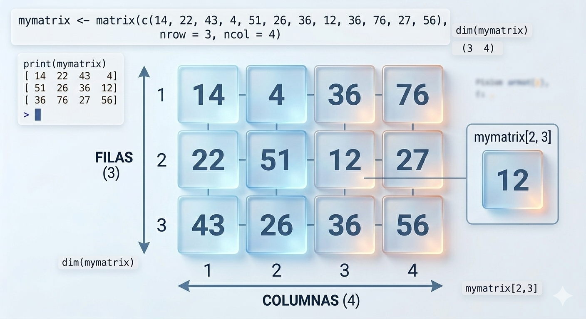

# 6. Matrices

Una matriz es una estructura de datos **bidimensional** que organiza elementos del mismo tipo (como números, caracteres o valores lógicos) en una cuadrícula de **filas** (nrows) y **columnas** (ncol).

Puedes visualizarla como una tabla matemática donde cada elemento es identificado por dos coordenadas o índices: la posición de su fila y la posición de su columna.

**Puntos clave**:

-   Homogeneidad: Todos los datos dentro de la matriz deben ser del mismo tipo (por ejemplo, no puedes mezclar texto y números en una misma matriz).

-   Bidimensionalidad: A diferencia de un vector (que solo tiene una dimensión), la matriz requiere dos índices para acceder a un valor: [i, j], donde i es la fila y j es la columna.

## 6.1. Crear  elementos de una matriz

La función principal es `matrix()`. Debes especificar los datos, el número de filas (nrow) o columnas (ncol).

Por defecto, las matrices se completan primero la columna 1, después la columna 2, columna 3, ....

```{r matrices}
# Crear una matriz 3x3 con elementos del 1 al 9
matrix(1:9, nrow = 3, ncol = 3)
```

```{r}
# Creamos una matriz de 4 filas y 34 columnas con datos selccionados por nosootros (van dentro de un vector)
matrix(c(14, 22, 43, 4, 51, 26, 36, 12, 36, 76, 27, 56), nrow = 3, ncol = 4)

```



Las matrices creadas suelen guardarse en una variable es fundamental porque sino se hace la matriz se mostrará en la consola y, a continuación, desaparecerá; no podrás volver a usarla.

```{r}
# Guardamos la matriz en la variable mimatriz

mimatriz <-matrix(20:25, nrow= 2, ncol=3)
print(mimatriz)

```

```{r}
#Reutilizamos la variable mimatriz

doble_mimatriz <- 2*mimatriz
print(doble_mimatriz)
```

## 6.2. Acceder a elementos de una matriz

Para acceder a un elemento específico dentro de una matriz en R, utilizamos el operador de **corchetes `[ ]`**, indicando las coordenadas mediante la notación `[fila, columna]`.

Aquí tienes cómo funciona:

### Sintaxis básica

`nombre_de_la_matriz[fila, columna]`

```{r matrices1}

# Acceder al elemento en la segunda fila y tercera columna

mi_matriz = matrix(1:9, nrow = 3,  ncol = 3)
print(mi_matriz)
elemento <- mi_matriz[2, 3]
print("**---------------------**")
print(elemento) # Solución: 8
```

Para accder a los datos de una fila completa:

```{r}
x <- matrix(1:6, 2, 3)
x

```

```{r}
x[2, ]    # segunda fila
x[, 2]    # segunda columna
x[1, 1:2] # primera fila, pero solo columnas 1ª y 2ª
```

## 6.3. Otras formas de crear matrices

**Ejemplo: Crear una matriz 2x4**

```{r matrices2}

matrix(1:8, nr = 2, nc = 4)
```

```{r matrices3}

matrix(1:8, 2, 4)               # por columnas (como Fortran)

```

En el siguiente caso la matriz rellena primero la fila 1, después la fila 2 ...

```{r matrices4}

matrix(1:8, 2, 4, byrow = TRUE) # por filas
```
