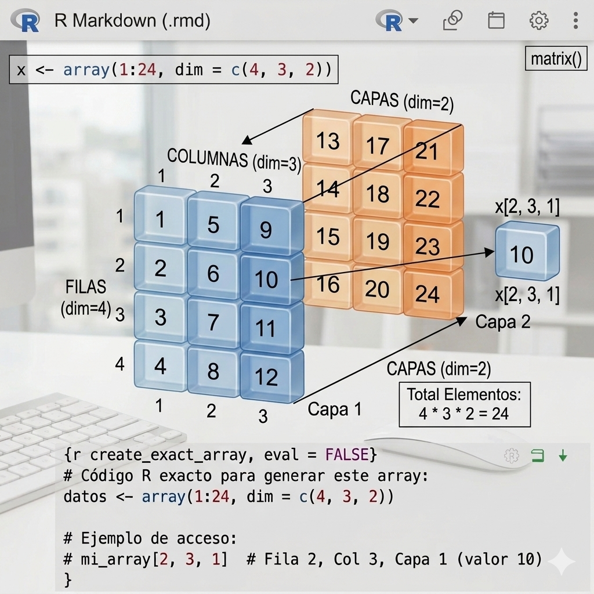

## 

Los **arrays** (arreglos), que son la evolución natural de las matrices en R.

Mientras que una matriz es una estructura de **dos dimensiones**, un array puede tener **tres o más dimensiones**. Puedes imaginar un array como un "bloque" o "cubo" de datos, donde tienes múltiples matrices apiladas. El cubo de Rubik puede considerarse un array,

## 7.1. Definición del Array

Sintaxis general:

``` r
array(datos, dim = c(filas, columnas, capas))
```

Ejemplo:

Creamos un array de 24 elementos con **filas =4, columnas =3, capas/profundidad = 2**)

El número de elementos serán 4 filas \* 3 columnas \* 2 capas= **24 elementos**

``` r
x <- array(1:24, dim = c(4, 3, 2))
```

Analicemos tu código paso a paso:

```{r arrays}
x <- array(1:24, dim = c(4, 3, 2))
x


```

Conocer las **dimensiones** (filas, columnas, capas) del array x:

```{r}
dim(x)
```

Aquí has creado un array 24 elementos con dimensiones `4` (filas), `3` (columnas) y `2` (capas o "slices"). Es decir, tienes dos matrices de 4x3.

{width="651"}

## 7.2. Acceso a los elementos de un array

Sintaxis del elemento al que se quiere acceder:

`nombre_array[numeroFila, numeroColumna, numeroCapa]`

-   Selección de un **elemento** individual:

```{r}
#Aquí estás seleccionando al elemento del la capa 1, columna 3 y fila 2

x3 <- x[2 , 3 , 1]
x3
```

Selección de una columna:

```{r}
# Aquí estás seleccionando el elemento de la capa 1 y columna 2.

x2 <- x[ , 2, 1]
x2
```

Selección de una **capa**/matriz:

```{r}

# Al poner 1 en la tercera posición del índice (numeroCapa), estás extrayendo la primera matriz completa del cubo.

x1 <- x[ , , 1]
x
```

## 7.3 . Añadir elementos a un array ya creado anteriormente

Imaginemos que tenemos el array x creado anteriormente de dimensiones (4 filas, 3 columnas, 2 filas)

(No entiendo bien)

```{r}
cbind(x, c(50, 55))
rbind(x, c(50, 55, 60))

```
