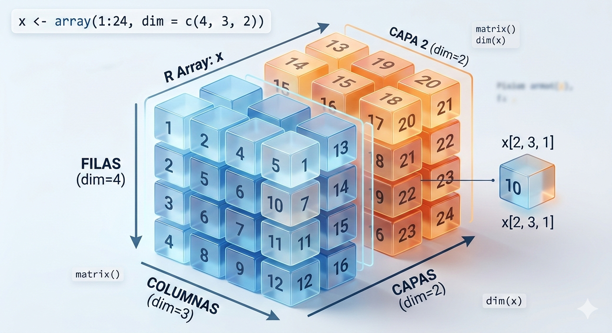

```{r arrays}
x <- array(1:24, dim = c(4, 3, 2))
x

x1 <- x[, , 1]; x1
x2 <- x[, 2, 1]; x2

cbind(x, c(50, 55))
rbind(x, c(50, 55, 60))
```

# 7. Arrays: los datos en forma de cubos

Los **arrays** (arreglos), que son la evolución natural de las matrices en R.

Mientras que una matriz es una estructura de **dos dimensiones**, un array puede tener **tres o más dimensiones**. Puedes imaginar un array como un "bloque" o "cubo" de datos, donde tienes múltiples matrices apiladas.

Analicemos tu código paso a paso:

### 7.1. Definición del Array

``` r
x <- array(1:24, dim = c(4, 3, 2))
```

Aquí has creado un array de 24 elementos con dimensiones `4` (filas), `3` (columnas) y `2` (capas o "slices"). Es decir, tienes dos matrices de 4x3.

### 7. 2. Acceso a elementos

-   `x1 <- x[, , 1]`: Al poner `1` en la tercera posición del índice, estás extrayendo la **primera matriz completa** del cubo.
-   `x2 <- x[, 2, 1]`: Aquí estás seleccionando la **segunda columna** de la **primera matriz**.

------------------------------------------------------------------------

### Observación importante sobre `cbind` y `rbind`

Aquí hay un detalle técnico muy importante que debes tener en cuenta al ejecutar tu código:

1.  **`cbind(x, c(50, 55))`**:

-   **¿Qué hace?** Intenta añadir una columna adicional a tu array.
-   **El desafío:** Como `x` es un array de 3 dimensiones, `cbind` intentará convertirlo a una matriz de 2 dimensiones para poder añadir la columna. R te dará una advertencia (o error, dependiendo de la versión) porque las dimensiones no coinciden perfectamente para una operación de este tipo.

2.  **`rbind(x, c(50, 55, 60))`**:

-   **¿Qué hace?** Intenta añadir una fila.
-   **El desafío:** Al igual que con `cbind`, estás intentando mezclar una estructura de 3 dimensiones con un vector simple, lo que obliga a R a forzar la estructura, perdiendo a menudo la información de la tercera dimensión original.

### Un consejo para el futuro

Cuando trabajes con arrays (3D o superior), en lugar de `rbind` o `cbind`, suele ser más limpio y seguro usar la función **`abind`** (del paquete del mismo nombre) o simplemente asignar nuevos valores a una nueva "capa" del array, por ejemplo:

``` r
# Ejemplo de cómo añadir una tercera capa (matriz) al array original
nueva_capa <- matrix(100:111, nrow = 4, ncol = 3)
x_nuevo <- abind(x, nueva_capa, along = 3)
```
