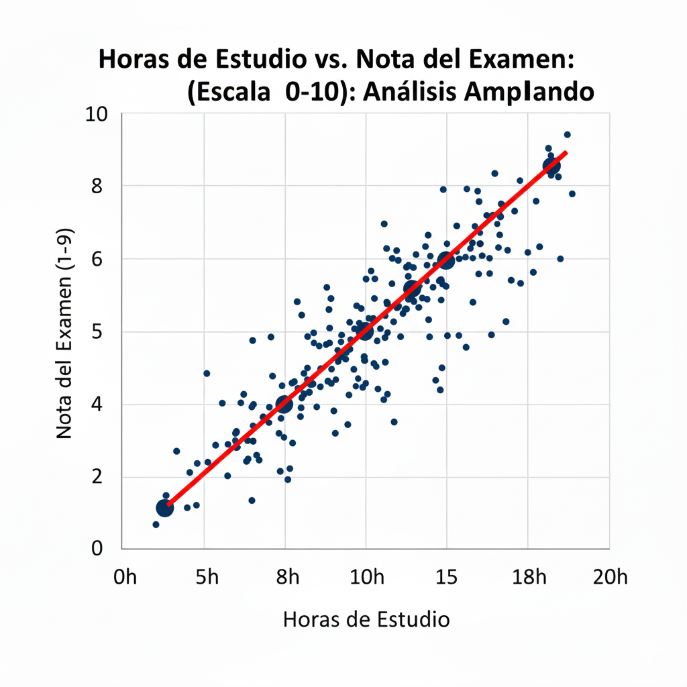

Los **gráficos de dispersión** son la herramienta fundamental para analizar si **existe correlación entre dos variables** **numéricas**.

{width="517"}

## Sintaxis: `plot`

`plot(datos_ejehorizontal, datos_eje_verical,`

`propiedad1,`

`propiedad2,`

`...)`

#### Ejemplo básico

Gráfico de dispersión **a partir de dos vectores**.

```{r}
# Crear datos de ejemplo
x <- c(1, 2, 3, 4, 5)
y <- c(2, 4, 6, 8, 10)

# Crear el gráfico de dispersión
plot(x, y,                      # Eje horizontal el vector x , Eje vertical vector y
     main = "Relación Lineal Simple",   # Título principal
     xlab = "Variable X",               # Título (label) del eje horizontal
     ylab = "Variable Y",               # Título (label) del eje vertical
     pch = 16,                          # Forma del punto (16 = círculo relleno)
     col = "blue")                      # Color de los puntos
```

------------------------------------------------------------------------

#### Ejercicio 1: Gráfico de dispersión a partir de los datos de un data()

#### Velocidad vs. Distancia de frenado

Utilizando el conjunto de datos `cars` (velocidad en millas/hora y distancia de frenado en pies), realiza un gráfico que sea fácil de interpretar.

```{r}
# Cargamos los datos de ejemplo de R: cars
data(cars)

# Representamos Speed frente a Dist
plot(cars$speed, cars$dist,
     main = "Relación: Velocidad vs Distancia de frenado",
     xlab = "Velocidad (mph)",
     ylab = "Distancia de frenado (ft)",
     pch = 19,               # Punto más definido
     col = "darkred",        # Color más profesional
     frame.plot = FALSE,)     # Estilo más limpio (sin recuadro)
```

------------------------------------------------------------------------

### ¿Quieres darle un toque extra?

A estos gráficos puedes añadirles una **línea de tendencia** (regresión lineal) sobre los puntos para que vean la "tendencia" de los datos:

``` r

# Añadir esto al gráfico para añadir la línea de regresión sobre el gráfico anterior
abline(lm(dist ~ speed, data = cars), col = "black", lwd = 2)
```

```{r}
plot(cars$speed, cars$dist,
     main = "Relación: Velocidad vs Distancia de frenado",
     xlab = "Velocidad (mph)",
     ylab = "Distancia de frenado (ft)",
     pch = 19,               # Punto más definido
     col = "darkred",        # Color más profesional
     frame.plot = FALSE,     # Estilo más limpio (sin recuadro)
     abline(lm(dist ~ speed, data = cars), col = "black", lwd = 2))
```
