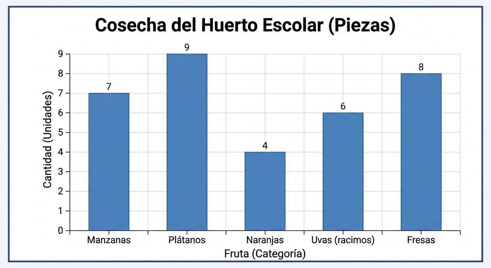

Los **gráficos de barras** son la herramienta estándar para visualizar la distribución de **datos categóricos** (o variables discretas con pocos niveles), permitiendo comparar frecuencias entre distintos grupos de forma rápida.

{width="430"}

**¿Qué son los datos categóricos?**

Un **dato categórico** (también llamado cualitativo) es aquel que no representa una cantidad numérica en sí misma, sino que describe una cualidad, propiedad o etiqueta que permite clasificar a los individuos o elementos en grupos (o "categorías").

En pocas palabras: No te dice "cuánto hay", te dice "qué tipo es".

-   **Género**: Hombre, Mujer, No binario.

    -   Ejemplo: número hombres y mujeres que hay en una clase.

-   **Estado civil:** Soltero, Casado, Divorciado, Viudo.

    -   Ejemplo: número solteros, casados... que trabajen en una empresa.

-   **Nivel educativo**: Primaria, Secundaria, Bachillerato, Universidad.

-   Color de ojos: Marrón, Azul, Verde, Negro.

## Sintaxis: `barplot`

`barplot(datos_ejehorizontal, names.arg =`

`propiedad1,`

`propiedad2,`

`...)`

**Ejemplo 1: con 1 vector**

```{r}

colores_ojos <- c("azul", "verde", "verde", "marrón", "azul", "negro", "negro", "azul")

frecuencias<-table(colores_ojos)
frecuencias
barplot(frecuencias)

```

#### 1. Ejemplo básico: Barras verticales a partir de dos vectores (uno categórico y otro numérico)

Este ejemplo muestra cómo definir manualmente las categorías y sus frecuencias para crear un gráfico sencillo, **a partir de dos vectores** (categorías y frecuencias).

```{r barplot-basic}
# Crear datos de ejemplo
colores_ojos <- c("Verde", "Azul", "Marrón", "Negro")
frecuencias <- c(10, 15, 8, 12)

# Crear el gráfico de barras
barplot(frecuencias,         # altura de las baras
        names.arg = colores_ojos,
        main = "Distribución de Categorías",
        xlab = "Categorías",
        ylab = "Frecuencia",
        col = "seagreen3") # Color más equilibrado

```

------------------------------------------------------------------------

#### Ejercicio 2: Barras verticales a partir de un data()

#### Frecuencias con `mtcars:`

Cuando trabajamos con bases de datos, no podemos contar los casos a mano. Usamos R para resumir y visualizar:

1.  **Resumir:** Usamos `table()` para contar cuántos elementos hay en cada categoría.

2.  **Visualizar:** Usamos `barplot()` para representar esas frecuencias.

Fragmento de código

```{r}
# Cargar datos mtcars 
data(mtcars) 

# Visualizamos los cinco primeras filas para hacernos una idea de la estructura
head(mtcars)


```

Vamos a contar las veces que se repiten el nº de cilindros de un coche. Con el comando `table` creamos una tabla resumen con el número de coches diferenciados por cilindros. Verás que hay:

-   con 4 cilindros: 11 coches

-   con 6 cilindros: 7 coches

-   con 8 cilindros; 14 coches

```{r}
# Resumir: Contar cuántos coches hay según número de cilindros (cyl) con el comando table
mitabla <- table(mtcars$cyl) 
print(mitabla) 
```

Ahora creamos el gráfico de barras con esta tabla (mitabla) que hemos obtenido de mtcars:

```{r}
# Visualizar: Gráfico de barras verticales 
barplot(mitabla,                            # No hay que indicar datos x, ni datos y. El eje x será la fila sup. de la tabla        main = "Distribución de Cilindros",         
        xlab = "Número de cilindros",          
        ylab = "Frecuencia",         
        col = c("slategray", "steelblue", "firebrick"),         
        legend = rownames(mitabla))  
```

Si el número de categorías es muy grande, oodemos convertir un gráfico de barras vertical, en uno horizontal añadiendo la propiedad `horiz = TRUE`.

```{r}
# Gráfico de barras horizontales (útil si los nombres de las categorías son largos)
barplot(mitabla, 
        main = "Distribución de Cilindros (Horizontal)",
        ylab = "Número de cilindros", 
        xlab = "Frecuencia", 
        horiz = TRUE,
        col = "skyblue")
```

### Conceptos clave:

-   **Dato Categórico:**

    -   Es una etiqueta/grupo como Género (Hombre-Mujer), Estudios (Primaria-Secundaria-Universidad), color de ojos (Marrones-Verdes-Azules).

    -   Un caso especial es el del último ejercicio, ya que partimos de ua columna de tipo numérica (cilindros) . Como queremos hacer una gráfica de barras con el nº de coches (eje y que hay por cada categoría de cilindros (eje x), entonces "categorizamos" el número de cilindros, contando el nº de coches oor número de cilindros, Esto se hace con el comando `table` , que crea una tabla contando nº de coches en cada grupo de nº de cilindros. Es una etiqueta o grupo (ej. 4, 6 u 8 cilindros). No calculamos medias, **contamos** cuántos elementos pertenecen a cada grupo.

-   **`table()`:** Es el contador automático de R.

-   **Reutilización:** Si cambias `mtcars$cyl` por otra columna (como `mtcars$gear`), el gráfico se actualizará automáticamente con el número de marchas (gear, en inglés)

#### Ejercicio 3: Visualización de Datos Crudos con `mtcars`

En este ejercicio, graficaremos la potencia (caballos de fuerza) de los primeros 10 modelos del famoso dataset `mtcars`. El objetivo es ver cómo una **variable categórica** (el nombre del coche) se relaciona con una **variable numérica** (los caballos de fuerza).

```{r}
data(mtcars)
head(mtcars)
barplot(mtcars$hp[1:10], 
        names.arg = rownames(mtcars)[1:10], 
        main = "Caballos de Fuerza de los primeros 10 coches",
        xlab = "", # Dejamos vacío el eje X porque las etiquetas ya dicen los modelos
        ylab = "Caballos de fuerza (Numérico)",
        col = "steelblue",
        las = 2,           # Gira los nombres 90 grados para que se lean bien
        cex.names = 0.7)   # Reduce el tamaño de la letra de los nombres
```

### Explicación del Código

-   **`mtcars$hp[1:10]`**: Le decimos a R que solo queremos la columna de caballos de fuerza (`hp`) y solo las primeras 10 filas (`1:10`). No estamos sumando ni promediando; usamos el valor **crudo**.
-   **`names.arg = rownames(mtcars)[1:10]`**: Esta es la parte clave para las **categorías**. En `mtcars`, los nombres de los coches no están en una columna, sino en los "nombres de las filas". Con esto, R pone "Mazda RX4", "Datsun 710", etc., debajo de cada barra.
-   **`las = 2`**: Por defecto, R escribe las etiquetas en horizontal. Como los nombres de los coches son largos, se amontonarían. El `2` le indica a R que las gire 90 grados (vertical).
-   **`par(mar = ...)`**: Es la configuración de los márgenes. El primer número (`10`) es el margen de abajo. Lo subimos para que haya espacio suficiente para los nombres verticales de los coches.
-   **`cex.names = 0.7`**: Es un multiplicador de tamaño. Al poner `0.7`, los nombres se ven un 30% más pequeños para asegurar que quepan todos.

------------------------------------------------------------------------

### Resultado esperado

Verás que el **Duster 360** es el coche más potente de este grupo inicial, superando los 200 HP, mientras que el **Merc 240D** es el más modesto.

¿Te gustaría probar ahora con el **consumo de gasolina (mpg)** para ver cuáles son los coches más ahorradores de esos mismos 10?
