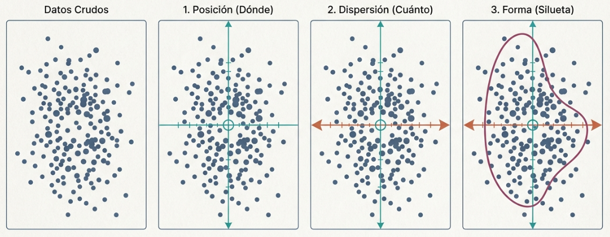
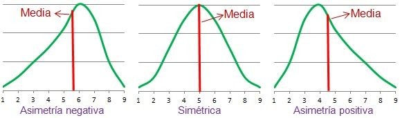
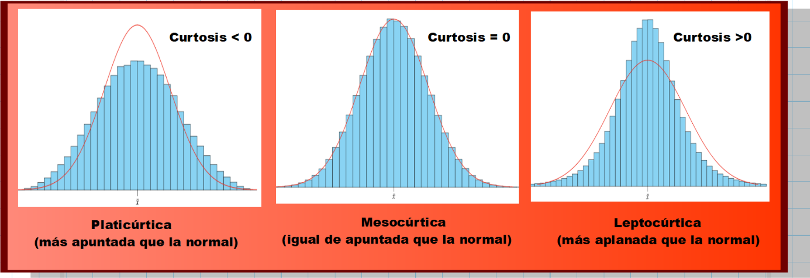
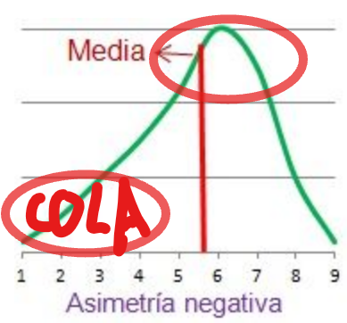
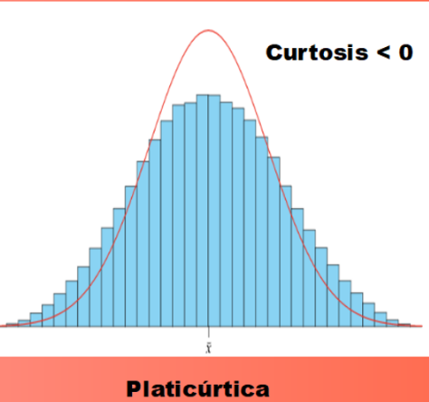

## Introducción

Lo que tienes en este apartado es lo más importante del **análisis descriptivo** que es el primer paso en cualquier estudio de datos. Básicamente, cuando tienes un montón de números, necesitas tres "fotos" para entenderlos: dónde están (**posición**), qué tan regados están (**dispersión**) y qué cara tienen (**forma**).

{width="332"}

## Introducción al Análisis Descriptivo

Para entender un conjunto de datos, no basta con mirar un solo número. Necesitamos tres "fotografías" distintas para captar la realidad completa: **dónde están** (posición), **qué tan regados están** (dispersión) y **qué cara tienen** (forma).

------------------------------------------------------------------------

### 1. Posición (¿Dónde están?)

Indican el **centro** o los **puntos de corte** de los datos.

-   **Media (**$\bar{x}$): El promedio aritmético. Es el "centro de gravedad".
-   **Mediana (**$\tilde{x}$): El valor central que divide la muestra exactamente al 50%. Es robusta frente a valores extremos.
-   **Moda:** El valor que más se repite en el conjunto.
-   **Cuantiles:** Los "cortes" que dividen los datos en partes iguales (Cuartiles: 25%, 50%, 75%; Deciles: 10%; Percentiles: 1%).

```{r posicion}
data(mtcars)
# Ejemplo con la variable 'hp' (caballos de fuerza)
 mean(mtcars$hp)
 median(mtcars$hp)
 quantile(mtcars$hp, probs = c(0.25, 0.5, 0.75))

```

------------------------------------------------------------------------

### 2. Dispersión (¿Qué tan regados están?)

Indican la **variabilidad**. Nos dicen qué tan "mentirosa" o representativa es la media.

-   **Desviación Estándar (**$s$): El promedio de alejamiento de los datos respecto a la media.
-   **Varianza (**$s^2$): La desviación al cuadrado. Fundamental para estadística inferencial.
-   **Rango Intercuartílico (IQR):** La distancia entre el $Q_1$ (25%) y el $Q_3$ (75%). Es el "corazón" de los datos.
-   **Rango:** La distancia total entre el valor máximo y el mínimo.
-   **Coeficiente de Variación (CV):** La dispersión expresada en porcentaje. Ideal para comparar grupos con distintas unidades.

```{r dispersion}
# sd(datos$salario)
# var(datos$salario)
# IQR(datos$salario)
# cv <- function(x) sd(x) / abs(mean(x))

```

------------------------------------------------------------------------

### 3. Forma (¿Qué cara tienen?)

Indican la **silueta** de la distribución y su parecido con la campana de Gauss (Normal).

#### **Asimetría (Skewness)**

-   **0:** Perfectamente simétrica.
-   **Positiva (\> 0):** La "cola" se alarga hacia la derecha (valores altos inusuales).
-   **Negativa (\< 0):** La "cola" se alarga hacia la izquierda (valores bajos inusuales).

#### **Curtosis (Apuntamiento)**

-   **Mesocúrtica (0):** Distribución normal.
-   **Leptocúrtica (\> 0):** Muy picuda. Muchos datos concentrados en el centro y colas pesadas.
-   **Platicúrtica (\< 0):** Aplanada. Los datos están muy repartidos.

```{r forma}
# library(moments)
# skewness(datos$salario)
# kurtosis(datos$salario) - 3  # Restamos 3 para obtener el exceso de curtosis

```

------------------------------------------------------------------------

> **Nota de R:** Recuerda que un gráfico siempre vale más que mil tablas. Usa `boxplot()` para posición/dispersión e `hist()` para la forma.

## 1. Medidas de Posición

Las medidas de posición resumen la localización central y los puntos de corte de la distribución.

¡ATENCIÖN! Como no tienes el archivo salarios, lo hago con un vector. Si no tendrías que hacer

-   `datos <- read.txt("salarios.txt, ......)`

-   `mean(datos$nombre_columna_donde estén_los _salarios)`

> Si no te acuerdas mira los apuntes de la profesora y mira cómo lo hace.

Lo hago con un vector (`salarios`) inventado:

```{r}
# Este vector lo necesitas para calculas skewness
salarios <- c(
  2675, 4122, 2891, 1943, 3310, 4452, 2768, 1502, 3684, 2197, 
  4391, 3054, 2567, 1823, 4015, 3128, 2341, 1675, 3762, 2901, 
  4210, 3543, 1489, 2755, 3982, 2267, 4412, 1987, 3245, 2671, 
  1356, 3890, 3122, 2456, 4078, 2893, 1765, 3521, 2109, 4345, 
  3287, 2654, 1902, 4156, 3432, 2589, 1567, 3843, 2987, 2234, 
  4487, 3356, 2789, 1856, 4298, 3654, 2467, 1690, 3954, 3021, 
  1456, 4012, 3390, 2734, 4367, 2123, 3765, 2934, 1999, 4123, 
  3512, 2645, 1543, 3821, 3098, 2376, 4432, 3210, 2854, 1789, 
  4067, 3476, 2543, 1623, 3901, 3167, 2489, 4312, 3345, 2712, 
  1876, 4189, 3587, 2698, 1598, 3876, 3056, 2312, 4456, 3267
)

```

```{r}
# Tendencia central
mean(salarios)   # Media aritmética
median(salarios) # Mediana (valor que divide a la muestra al 50%)
```

```{r}
# Cuartiles (0.25, 0.5, 0.75)
quantile(salarios, c(0.25, 0.5, 0.75))
```

```{r}

# Deciles (divide en 10 partes iguales)
quantile(salarios, prob = seq(0, 1, length = 11))
```

```{r}
# Percentiles (divide en 100 partes iguales)
quantile(salarios, prob = seq(0, 1, length = 101))
```

## 2. Medidas de Dispersión

Estas medidas cuantifican cuánto se alejan los datos de su centro.

```{r measures-dispersion}
# Rango: diferencia entre el valor máximo y mínimo
rango <- max(salarios) - min(salarios)

# Rango Intercuartílico: dispersión del 50% central de los datos
IQR(salarios)

# Varianza y Desviación estándar
var(salarios)
sd(salarios)  # Raíz cuadrada de la varianza

# Coeficiente de Variación: medida relativa de dispersión (útil para comparar grupos)
cv <- function(x) { sd(x) / abs(mean(x)) }
cv(salarios)

```

```{r}
# Rango: diferencia entre el valor máximo y mínimo
max(salarios)
min(salarios)
max(salarios) - min(salarios)

```

```{r}
# Rango Intercuartílico: dispersión del 50% central de los datos
IQR(salarios)
```

```{r}
# Varianza y Desviación estándar
var(salarios)
sd(salarios)  # Raíz cuadrada de la varianza
```

```{r}
# Coeficiente de Variación: medida relativa de dispersión (útil para comparar grupos)
cv <- function(x) { sd(x) / abs(mean(x)) }
cv(salarios)
```

## 3. Medidas de Forma

Evalúan la distribución de los datos respecto a la normalidad.

El código siguiente hace dos cosas fundamentales para entender la "cara" de tus datos:

-   **hist()** (Lo visual): Dibuja un histograma para que veas la forma de la distribución de tus salarios.

-   **skewness()** (Lo matemático): **Calcula un número que mide si los datos están repartidos equitativamente** o si hay una "cola" larga de valores extremos (asimetría).

En una frase: Es el diagnóstico que te permite confirmar visual y numéricamente si tus salarios siguen una distribución normal o si están "estirados" hacia algún extremo.

### 3.1. Asimetría (Skewness)

Mide la falta de **simetría respecto a la media.**

-   **Valor 0:** Simétrica.
-   **Valor \> 0:** Asimetría positiva (cola hacia la derecha).
-   **Valor \< 0:** Asimetría negativa (cola hacia la izquierda).

{width="409"}

### 3.2. Curtosis (Apuntamiento)

Indica la concentración de datos en la zona central y la "pesadez" de las colas. Para compararla con la Normal, usamos el **exceso de curtosis** (restando 3).

-   **Mesocúrtica (Exceso = 0):** Distribución normal.
-   **Leptocúrtica (Exceso \> 0):** Más apuntada (pico alto, colas pesadas).
-   **Platicúrtica (Exceso \< 0):** Más achatada.

{width="612"}

------------------------------------------------------------------------

## Ejercicio:

**Objetivo:** Evaluar la "silueta" y la normalidad de las variables cuantitativas mediante medidas de forma (**skewness**/asimetría y **curtosis**), combinando el análisis gráfico con el cálculo estadístico.

**Datos**: salario y tiempo en la empresa.

```{r}
salarios <- c(
  2675, 4122, 2891, 1943, 3310, 4452, 2768, 1502, 3684, 2197, 4391, 3054, 2567, 1823, 4015, 3128, 2341, 1675, 3762, 2901, 4210, 3543, 1489, 2755, 3982, 2267, 4412, 1987, 3245, 2671,  1356, 3890, 3122, 2456, 4078, 2893, 1765, 3521, 2109, 4345,  3287, 2654, 1902, 4156, 3432, 2589, 1567, 3843, 2987, 2234,  4487, 3356, 2789, 1856, 4298, 3654, 2467, 1690, 3954, 3021,  1456, 4012, 3390, 2734, 4367, 2123, 3765, 2934, 1999, 4123,  3512, 2645, 1543, 3821, 3098, 2376, 4432, 3210, 2854, 1789, 4067, 3476, 2543, 1623, 3901, 3167, 2489, 4312, 3345, 2712, 1876, 4189, 3587, 2698, 1598, 3876, 3056, 2312, 4456, 3267
)

tiempemp = c(
    28, 14, 21, 5, 23, 29, 14, 30, 26, 10, 29, 21, 16, 8, 27, 22, 12, 19, 26, 20, 
    28, 25, 29, 14, 27, 11, 29, 9, 22, 15, 30, 27, 22, 11, 28, 20, 18, 25, 10, 29, 
    22, 15, 9, 28, 24, 16, 30, 27, 20, 12,30, 23, 15, 9, 29, 25, 12, 19, 27, 21, 
    30, 28, 23, 15, 29, 10, 26, 20, 9, 28, 24, 15, 30, 27, 21, 12, 29, 22, 20, 19, 
    28, 25, 16, 18, 27, 22, 12, 29, 23, 15, 9, 28, 25, 15, 30, 27, 21, 12, 29, 22)
```

-   La **Asimetría** (skewness) nos indica la inclinación de la distribución respecto a la media

-   La **Curtosis** mide el grado de concentración de los datos en la zona central y el peso de las colas.

**ATENCIÓN**: Para hacer estos estudios hay que tener instalada la **librería** `moments`

```{r}
# 1. Asegúrate de tener la librería necesaria instalada
# install.packages("moments")
library(moments)
```

### A. Cálculo de la skewness (asimetría de la curva)

El código siguiente hace dos cosas fundamentales para entender la "cara" de tus datos:

-   **hist(salarios, ...)** (Lo visual)**: Dibuja un histograma** para que veas la forma de la distribución de tus salarios.

-   **skewness**() (Lo matemático): **Calcula un número que mide si los datos están repartidos equitativamente o si hay una "cola" larga de valores extremos** (asimetría).

    En una frase: Es el diagnóstico que te permite confirmar visual y numéricamente si tus salarios siguen una distribución normal o si están "estirados" hacia algún extremo.

Como verás, el resultado da un skewness (asimetría) de $-0.08806186$, lo que significa una skewness ligeramente negativa. Podríamos decir que con un valor tan bajo es casi cero. Podríamos decir que es casi simétrica.

-   Pero si nos diese un skewness de, **por ejemplo**, $-0.6$ , sí podríamos decir que tendría claramente esta forma:

{width="156"}

```{r}
# Asimetría
hist(salarios, main = "Distribución de Salarios")
asim_salario <- skewness(salarios)
asim_salario  # en este caso verás que da -0.08806186 (pequeña desviación)
```

### B. Cálculo de la curtosis

Este bloque de código hace dos cosas muy específicas para medir la curtosis (la "agudeza" o "pesadez" de las colas de la distribución):

1.  **hist(tiempemp, ...) ¿**Qué hace?: Dibuja el **histograma de la variable "tiempo en empleo"**.
    -   ¿Para qué sirve?: Te permite ver visualmente si los datos están muy concentrados en un pico central muy alto, o si son más planos y dispersos.
2.  **curt_tiempo \<- kurtosis(tiempemp) -3**: ¿Qué hace?: Calcula la curtosis y le resta 3. A este resultado se le llama **Exceso de Curtosis**.

-   **¿Por qué el "- 3"?:**

    -   La Distribución Normal (la famosa "campana de Gauss") tiene una curtosis matemática de 3.

    -   Al restarle 3, estamos "normalizando" el valor: ahora, el 0 es nuestro punto de referencia perfecto para la normalidad.

**Interpretación de los resultados :** Verás que da una **curtosis** de $-1.05239$, esto significa:

-   Es una distribución **Platicúrtica**: Al ser un número negativo, significa que tu distribución es "más plana" o "achatada" que una distribución normal.

-   **Visualmente:** Imagina una campana de Gauss normal; la tuya se ve como si alguien la hubiera presionado desde arriba, haciéndola más ancha y con los bordes menos marcados.

    {width="175"}

```{r}
# Exceso de Curtosis
hist(tiempemp, main = "Distribución de Tiempo en Empleo")
curt_tiempo <- kurtosis(tiempemp) - 3
# Mostramos el valos de curt_tiempo que almacene la curtosis
curt_tiempo
```

### C. Presentación final de los resultados skewnesso asimetría y curtosis

```{r}
# Resultados
cat("Asimetría:", asim_salario, "\nExceso de Curtosis:", curt_tiempo)
```
