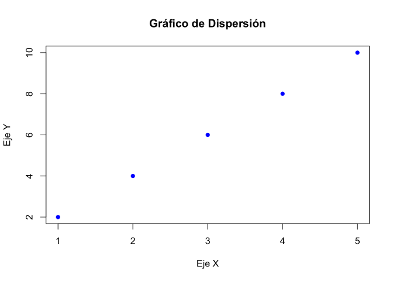
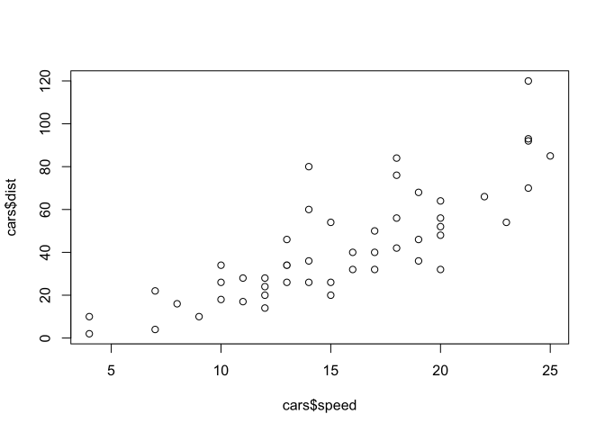
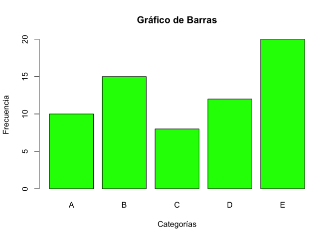
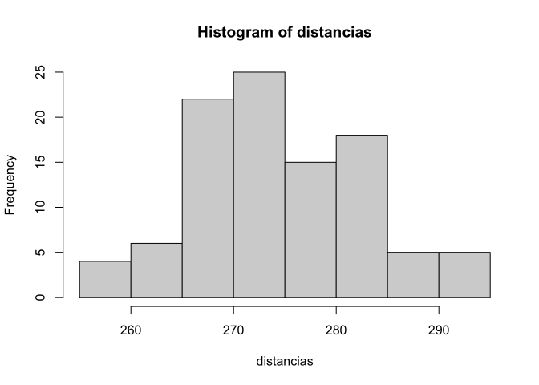
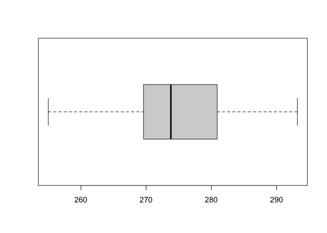
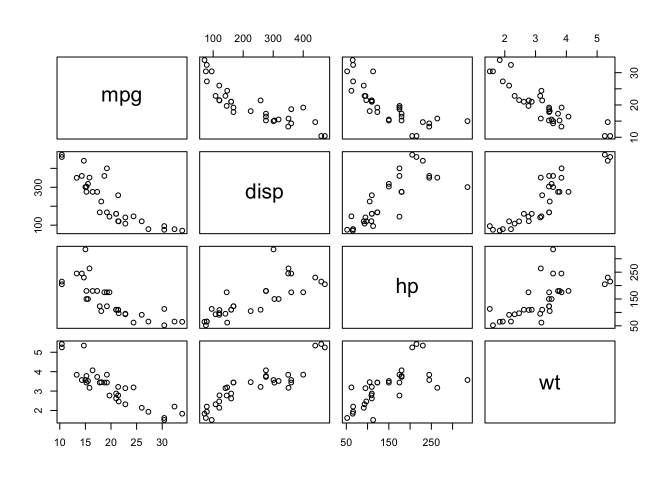
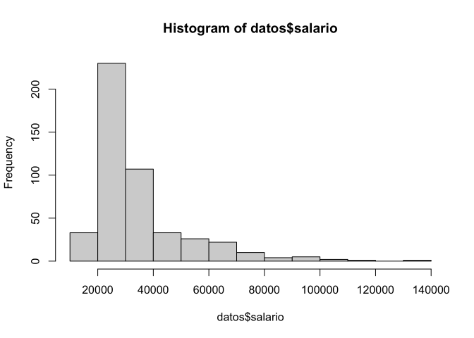
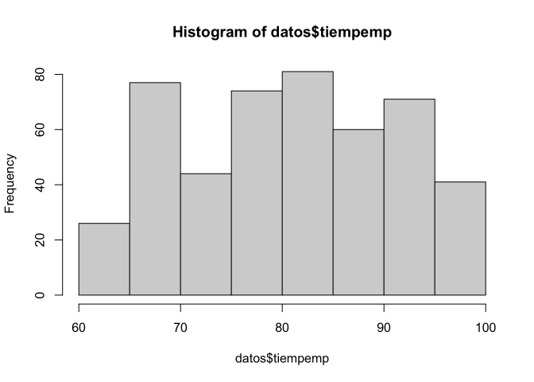

Gráficos de Dispersión:

Los gráficos de dispersión son útiles para visualizar la relación entre dos variables numéricas. Aquí hay un ejemplo de cómo crear uno:

`   `*# Crear datos de ejemplo*

`   `x <- c(1, 2, 3, 4, 5)

`   `y <- c(2, 4, 6, 8, 10)

`   `*# Crear el gráfico de dispersión*

`   `plot(x, y,

`     `main = "Gráfico de Dispersión",

`     `xlab = "Eje X",

`     `ylab = "Eje Y",

`     `pch = 16,  *# Cambiar el tipo de punto*

`     `col = "blue"  *# Cambiar el color de los puntos*

`   `)

- Ejercicio 1: Representa en un diagrama de dispersión la variable X “speed” y la variable Y “dist” de la base de datos **data(cars)**

data(cars)

plot(cars$speed, cars$dist) 

Gráficos de Barras y sectores:

Los gráficos de barras son excelentes para mostrar la distribución de datos categóricos. Aquí hay un ejemplo:

`   `*# Crear datos de ejemplo*

`   `categorias <- c("A", "B", "C", "D", "E")

`   `frecuencias <- c(10, 15, 8, 12, 20)

`   `*# Crear el gráfico de barras*

`   `barplot(frecuencias,

`        `names.arg = categorias,

`        `main = "Gráfico de Barras",

`        `xlab = "Categorías",

`        `ylab = "Frecuencia",

`        `col = "green"  *# Cambiar el color de las barras*

`   `)

- Ejercicio 2:

Cuando una variable toma sólo un número pequeño de valores distintos es habitual resumir la información utilizando una tabla de frecuencias función table() que se puede representar con un gráfico de barras.

data(mtcars); **attach**(mtcars)

*# Tabla de frecuencias*

tabla=table(cyl)

tabla

*# Grafico de barras*

barplot(tabla, main="Gráfico de barras", *# título* 

`        `xlab="Número de cilindros", ylab="Frecuencia", *# etiquetas*

`        `col=c("darkgrey","darkblue","red"), *# color*

`        `legend=rownames(tabla)) *# leyenda*

barplot(tabla, main="Gráfico de barras", 

`        `ylab="Número de cilindros", xlab="Frecuencia", 

`        `horiz=TRUE)

Histogramas y gráfico de densidad

Este gráfico es uno de los más habituales para representar datos continuos, y consiste en representar con barras con las frecuencias con que aparecen las mediciones agrupadas en ciertos intervalos. Se pueden crear histogramas con la función hist(x) donde

- x: es un vector numérico de valores a representar
- freq = FALSE: representa densidades de probabilidad en lugar de frecuencias.
- breaks: controla el número de de barras

distancias=c(

291\.5, 274.4, 290.2, 276.4, 272.0, 268.7, 281.6, 281.6, 276.3, 285.9,

269\.6, 266.6, 283.6, 269.6, 277.8, 287.8, 267.6, 292.6, 273.4, 284.4,

270\.7, 274.0, 285.2, 275.5, 272.1, 261.3, 274.0, 279.3, 281.0, 293.1,

277\.5, 278.0, 272.5, 271.7, 280.8, 265.6, 260.1, 272.5, 281.3, 263.0,

279\.0, 267.3, 283.5, 271.2, 268.5, 277.1, 266.2, 266.4, 271.5, 280.3,

267\.8, 272.1, 269.7, 278.5, 277.3, 280.5, 270.8, 267.7, 255.1, 276.4,

283\.7, 281.7, 282.2, 274.1, 264.5, 281.0, 273.2, 274.4, 281.6, 273.7,

271\.0, 271.5, 289.7, 271.1, 256.9, 274.5, 286.2, 273.9, 268.5, 262.6,

261\.9, 258.9, 293.2, 267.1, 255.0, 269.7, 281.9, 269.6, 279.8, 269.9,

282\.6, 270.0, 265.2, 277.7, 275.5, 272.2, 270.0, 271.0, 284.3, 268.4)

hist(distancias) *# frecuencia*

hist(distancias, prob=TRUE) *#densidad*

Los histogramas son muy útiles para apreciar la forma de la distribución de los datos. Sin embargo, este tipo de gráfico se ve muy afectado por el número de cortes (y su posición) utilizado.

- Con pocas clases se agrupan demasiado las observaciones, y
- Con muchas clases habrá pocas observaciones en cada una de ellas aumentando la variabilidad del gráfico obtenido.
- La función hist() por defecto selecciona el número de clases siguiendo el llamado método de Sturges.

par(mfrow=c(1,3))

hist(distancias,breaks=2,main="pocas clases")

hist(distancias,breaks=50,main="muchas clases")

hist(distancias,main="regla de Sturges")

par(mfrow=c(1,1))

Gráficos de caja o Boxplot

Los diagramas de caja (boxplot) son representaciones gráficas que permiten: resumir las principales características de los datos (posición, dispersión, asimetría,…) e identificar la presencia de observaciones atípicas (valores missing). La función boxplot(x,data=) permite crear este gráfico donde:

- x: es la fórmula que hace el gráfico. Un ejemplo de formula es y~group de forma que se obtiene un boxplot separado para la variable numérica ypor cada grupo.
- data=: data.frame con los datos
- horizontal=TRUE: barras horizontales
- varwidth=TRUE: ancho de las caja proporcional a la raíz cuadrada de los tamaños muestrales de los grupos

boxplot(distancias, horizontal=TRUE)

- Ejercicio 3: Representa en gráfico de cajas la variable “mpg” y “cyl” de la base de datos **mtcars**

Matrices de gráficos de dispersión

La función pairs permite obtener directamente una matriz de gráficos de dispersión

pairs(~mpg+disp+hp+wt, data=mtcars)

Coeficiente de correlación variables continuas

pediatria <- read.csv2("children.csv")

corr=abs(cor(pediatria[,-1])) *# correlación en valor absoluto*

corr

\##            edad      peso     talla

\## edad  1.0000000 0.8194018 0.8667918

\## peso  0.8194018 1.0000000 0.9031220

\## talla 0.8667918 0.9031220 1.0000000

EJERCICIO 4:

1. Carga los datos children.csv (puedes utilizar la función read.csv2)
1. Elimina la primera columna de los datos
1. Representa una matriz de gráficos de dispersión con las variables edad, peso y talla, utlizando distinto color en función del sexo.
1. Calcula el coeficiente de correlación para las variables edad, peso y talla.

Tablas de frecuencias

Usando el comando table calculamos las frecuencias absolutas y con el comando prop.table las relativas.

datos <- read.table(file = "empleados.txt", header = TRUE)

head(datos)

\##   id   sexo   fechnac educ         catlab salario salini tiempemp expprev

\## 1  1 Hombre  2/3/1952   15      Directivo   57000  27000       98     144

\## 2  2 Hombre 5/23/1958   16 Administrativo   40200  18750       98      36

\## 3  3  Mujer 7/26/1929   12 Administrativo   21450  12000       98     381

\## 4  4  Mujer 4/15/1947    8 Administrativo   21900  13200       98     190

\## 5  5 Hombre  2/9/1955   15 Administrativo   45000  21000       98     138

\## 6  6 Hombre 8/22/1958   15 Administrativo   32100  13500       98      67

\##   minoria

\## 1      No

\## 2      No

\## 3      No

\## 4      No

\## 5      No

\## 6      No

tabla1d<-table(datos$sexo)

tabla1d

\## 

\## Hombre  Mujer 

\##    258    216

tabla1d.relativa<-prop.table(tabla1d)

tabla1d.relativa

\## 

\##    Hombre     Mujer 

\## 0.5443038 0.4556962

Podemos crear la tabla de frecuencias bidimensional:

tab2d<-table(datos$sexo, datos$catlab)

tab2d

\##         

\##          Administrativo Directivo Seguridad

\##   Hombre            157        74        27

\##   Mujer             206        10         0

El comando prop.table, nos permite calcular porcentajes de esta table de tres maneras:

- Para el total de casos de la tabla
- Para el total de casos de cada fila
- Para el total de casos de cada columna

prop.table(tab2d)\*100 *# Total de toda la tabla*

\##         

\##          Administrativo Directivo Seguridad

\##   Hombre      33.122363 15.611814  5.696203

\##   Mujer       43.459916  2.109705  0.000000

prop.table(tab2d, 1)\*100 *# Total de cada fila*

\##         

\##          Administrativo Directivo Seguridad

\##   Hombre       60.85271  28.68217  10.46512

\##   Mujer        95.37037   4.62963   0.00000

prop.table(tab2d, 2)\*100 *# Total de cada columna*

\##         

\##          Administrativo Directivo Seguridad

\##   Hombre       43.25069  88.09524 100.00000

\##   Mujer        56.74931  11.90476   0.00000

fa<-table(datos$edu) *#frecuencia absoluta*

fac <- cumsum(fa) *#frecuencia absoluta acumulada*

fr<-prop.table(fa) *#frecuencia relativa*

facr <- cumsum(fr) *#frecuencia relativa acumulada*

mitabla <-data.frame(fa, fac, fr, facr, row.names=NULL)[,-4]

colnames(mitabla)<-c("Data", "ni","Ni", "fi", "Fi")

mitabla

\##    Data  ni  Ni          fi        Fi

\## 1     8  53  53 0.111814346 0.1118143

\## 2    12 190 243 0.400843882 0.5126582

\## 3    14   6 249 0.012658228 0.5253165

\## 4    15 116 365 0.244725738 0.7700422

\## 5    16  59 424 0.124472574 0.8945148

\## 6    17  11 435 0.023206751 0.9177215

\## 7    18   9 444 0.018987342 0.9367089

\## 8    19  27 471 0.056962025 0.9936709

\## 9    20   2 473 0.004219409 0.9978903

\## 10   21   1 474 0.002109705 1.0000000

Para construir tablas de frecuencias de variables numéricas, debemos agrupar los valores de la variable en intervalos y convertirlos en categorías ordenadas.

temp=c(22.52, 18.70, 19.61, 22.79, 29.38, 30.19, 33.16,

36\.97, 33.29, 28.98, 24.31, 22.43)

temp2=cut(temp,breaks=c(0,20,30,50))

temp2

\##  [1] (20,30] (0,20]  (0,20]  (20,30] (20,30] (30,50] (30,50] (30,50] (30,50]

\## [10] (20,30] (20,30] (20,30]

\## Levels: (0,20] (20,30] (30,50]

Ejemplo con datos de pediatria creando intervalos para la variable edad.

pediatria=read.csv2("children.csv")

edad2=cut(pediatria$edad,breaks=seq(5,19))

aggregate(pediatria[,-1], by=list(edad=edad2), FUN=mean, na.rm=TRUE)

\##       edad      edad     peso    talla

\## 1    (5,6]  5.707500 21.50000 118.9500

\## 2    (6,7]  6.649310 23.40517 120.3414

\## 3    (7,8]  7.492360 24.87079 124.8000

\## 4    (8,9]  8.543613 28.49580 130.4160

\## 5   (9,10]  9.592599 31.19548 135.5582

\## 6  (10,11] 10.542931 36.39655 141.4655

\## 7  (11,12] 11.556667 38.43103 145.1511

\## 8  (12,13] 12.535377 43.94198 151.9792

\## 9  (13,14] 13.578763 49.93280 157.4968

\## 10 (14,15] 14.602862 54.59138 162.5007

\## 11 (15,16] 15.501473 57.51411 165.1204

\## 12 (16,17] 16.511189 59.91294 167.2969

\## 13 (17,18] 17.505679 61.77654 167.1420

\## 14 (18,19] 18.438681 62.06264 167.5692

Medidas de posición

mean(datos$salario)

\## [1] 34419.57

median(datos$salario)

\## [1] 28875

quantile(datos$salario, c(0.25, 0.5, 0.75)) *# Cuartiles*

\##     25%     50%     75% 

\## 24000.0 28875.0 36937.5

quantile(datos$salario, prob=seq(0,1, length=11)) *# Deciles*

\##       0%      10%      20%      30%      40%      50%      60%      70% 

\##  15750.0  21045.0  22950.0  24885.0  26700.0  28875.0  30750.0  34500.0 

\##      80%      90%     100% 

\##  40920.0  59392.5 135000.0

quantile(datos$salario, prob=seq(0,1, length=101)) *# Percentiles*

\##        0%        1%        2%        3%        4%        5%        6%        7% 

\##  15750.00  16309.50  16950.00  17278.50  18150.00  19492.50  19650.00  20100.00 

\##        8%        9%       10%       11%       12%       13%       14%       15% 

\##  20526.00  20850.00  21045.00  21300.00  21564.00  21750.00  21900.00  22050.00 

\##       16%       17%       18%       19%       20%       21%       22%       23% 

\##  22350.00  22411.50  22500.00  22780.50  22950.00  23149.50  23400.00  23700.00 

\##       24%       25%       26%       27%       28%       29%       30%       31% 

\##  24000.00  24000.00  24150.00  24406.50  24450.00  24625.50  24885.00  25144.50 

\##       32%       33%       34%       35%       36%       37%       38%       39% 

\##  25254.00  25500.00  25800.00  26032.50  26250.00  26400.00  26550.00  26700.00 

\##       40%       41%       42%       43%       44%       45%       46%       47% 

\##  26700.00  27000.00  27300.00  27450.00  27600.00  27750.00  27900.00  28050.00 

\##       48%       49%       50%       51%       52%       53%       54%       55% 

\##  28356.00  28500.00  28875.00  29100.00  29336.40  29400.00  29850.00  30000.00 

\##       56%       57%       58%       59%       60%       61%       62%       63% 

\##  30255.60  30391.50  30750.00  30750.00  30750.00  30900.00  31239.00  31500.00 

\##       64%       65%       66%       67%       68%       69%       70%       71% 

\##  31650.00  32017.50  32604.00  33300.00  33846.00  33900.00  34500.00  34800.00 

\##       72%       73%       74%       75%       76%       77%       78%       79% 

\##  35250.00  35593.50  36000.00  36937.50  37800.00  38850.00  39882.00  40200.00 

\##       80%       81%       82%       83%       84%       85%       86%       87% 

\##  40920.00  42391.00  43908.00  45471.25  47346.00  50027.50  51976.50  54630.00 

\##       88%       89%       90%       91%       92%       93%       94%       95% 

\##  55120.00  56744.00  59392.50  60893.75  65000.00  66695.00  68125.00  70000.00 

\##       96%       97%       98%       99%      100% 

\##  73850.00  78452.50  85100.00  97810.00 135000.00

Medidas de dispersión

rango<-max(datos$salario)-min(datos$salario)

rango

\## [1] 119250

IQR(datos$salario)

\## [1] 12937.5

var(datos$salario)

\## [1] 291578214

sd(datos$salario) *#sqrt(var(datos$salario))*

\## [1] 17075.66

coeficiente.variacion<- **function** (x) {sd(x)/abs(mean(x))}

coeficiente.variacion(datos$salario)

\## [1] 0.4961033

Medidas de forma

El coeficiente de asimetría de Fisher se basa en momentos centrales de orden 3, y utilizamos la función skewness del paquete moments para calcularlo.

**library**(moments)

hist(datos$salario)

asim\_salario <- skewness(datos$salario)

El coeficiente de curtosis o apuntamiento es uma medida de forma que mide cómo de escarpada o achadata está la distribución de la variable. Se basa en los momentos centrales de orden 4 y se calcula con la función kurtosis del mismo paquete. Puede ser, mesocúrtica (valor 0, como la campana de Gauss ), leptocúrtica (valor positivo, más apuntamiento que la campana de Gauss) o platicúrtica (valor negativo, menos apuntamiento que la campana de Gauss. El exceso de curtosis se le resta 3 al valor obtenido con la función kurtosis con objeto de generar un coeficiente que valga 0 para la Normal y tome a ésta como referencia de curtosis.

hist(datos$tiempemp)

curt\_tiempo <- kurtosis(datos$tiempemp)-3

cat("Asimetría:", asim\_salario, "\nCurtosis:", curt\_tiempo)

\## Asimetría: 2.117877 

\## Curtosis: -1.153103

