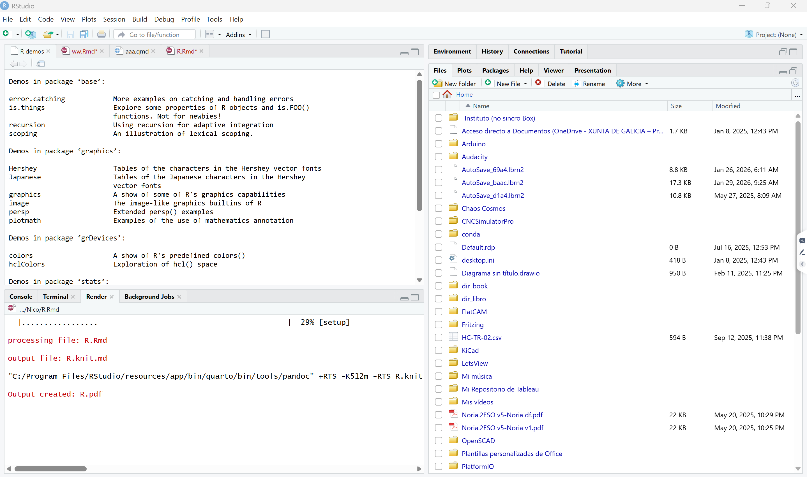

# Introducción ¿Qué es R y por qué es útil en Economía?

-   **R** es un **lenguaje de programación** muy potente diseñado específicamente para el **análisis estadístico y la visualización de datos**. Es el estándar en muchas áreas científicas y de negocios.

Para profundizar en la introducción de R aplicada a la **Economía**, es necesario entender que no estamos ante una simple calculadora, sino ante un laboratorio completo de econometría.

R es un lenguaje de código abierto diseñado específicamente para el análisis **estadístico y la visualización de datos**. En el ámbito económico, su utilidad radica en que se ha convertido en el estándar tanto en áreas científicas como en el mundo de los negocios.

## ¿Por qué R es el aliado del economista?

A diferencia de las hojas de cálculo tradicionales, R permite **manejar grandes volúmenes de datos** y asegurar la **reproducibilidad**. Si realizas un análisis hoy, cualquier otra persona puede ejecutar tu código y obtener exactamente los mismos resultados, algo vital en la investigación económica.

Haciendo un símil con un coche para entender las herramientas:

-   **R (El Motor):** Es la potencia bruta que realiza los cálculos matemáticos y estadísticos. Sin él, no hay movimiento.

-   **RStudio (El Volante y Tablero):** Es el entorno de desarrollo (IDE) que hace que escribir código sea una experiencia mucho más amigable, visual y cómoda. Es la interfaz que te permite controlar el motor sin complicaciones innecesarias.

## Áreas de aplicación en Economía

1.  **Econometría:** Estimación de modelos de regresión lineal y no lineal, series temporales y paneles de datos.
2.  **Análisis de Políticas Públicas:** Evaluación de impacto mediante la manipulación de microdatos (como censos o encuestas de hogares).
3.  **Visualización de Datos:** Creación de gráficos de alta calidad para reportes financieros o académicos.
4.  **Automatización:** Generación de informes automáticos mediante RMarkdown para combinar análisis y resultados en un solo paso.

EL proceso de trabajo con R está enfocado en el uso de tres herramientas:

1.  **R**, es el motor del lenguaje (hace los cálculos necesarios).

2.  **RStudio**, aplicación que facilita la programación en R.

3.  **RMarkdown**, aplicación incluida en RStudio que permite presentar los resultados de forma atractiva visualmente.

**¡Recuerda bien estos tres nombres!**

Esta base sólida es el primer paso del camino, que hemos dividido en tres etapas lógicas: el taller (**instalación**), el lenguaje (**sintaxis**) y la publicación (**RMarkdown**).

## El "taller": Instalación y configuración

Para trabajar cómodamente, normalmente no usamos **R** "a secas", sino que lo combinamos con **RStudio**, que es un entorno de desarrollo (IDE) que hace que *escribir código sea mucho más amigable*.

En esta sección, aprenderás a preparar tu equipo de trabajo. Los puntos clave a incluir son:

-   **Instalación dual**: Deben instalar primero R y luego RStudio.

-   **Interfaz de RStudio**: Es necesario conocer para qué sirve cada ventana del programa para que los usuarios se sientan orientados desde el primer momento.

Veamos las instalación **tanto en Windows como en Mac**. El proceso es muy similar, pero los archivos de instalación del "motor" (R) son distintos.

Vamos a instalar primero el **motor (R)**. Recuerda: sin esto, RStudio no funcionará.

> **Paso 1: Instalar R (El Motor)**

Ve al sitio oficial llamado **CRAN** (Comprehensive R Archive Network). Aquí es donde vive R.

Para Windows:

:   1.  Entra en: `cran.r-project.org/bin/windows/base/`

    2.  Haz clic en el enlace grande que dice **"Download R [versión] for Windows"**.

    3.  Ejecuta el archivo `.exe` y acepta todo por defecto (Siguiente, Siguiente...).

Para Mac:

:   1.  Entra en: `cran.r-project.org/bin/macosx/`

    2.  Aquí hay una pequeña bifurcación importante:

        -   Si tu Mac tiene chip **Apple (M1, M2, M3...)**, descarga el archivo que dice `arm64.pkg`.

        -   Si es una Mac más antigua con chip **Intel**, descarga el archivo que dice `x86_64.pkg`.

    3.  Instala el archivo `.pkg` como cualquier otra aplicación de Mac.

> **Paso 2: Instalar RStudio (El Tablero)**

Una vez que el motor está instalado en ambos equipos, vamos por el tablero de control.

1.  Ve al sitio de **Posit** (los creadores de RStudio): `posit.co/download/rstudio-desktop/`

2.  Desplázate hacia abajo hasta encontrar el botón **"Download RStudio Desktop for..."** (la página suele detectar tu sistema automáticamente).

3.  Instálalo (en Mac arrastrándolo a Aplicaciones, en Windows con el instalador).

### Verificación

Cuando termines, **no abras el icono de "R"**. Busca y abre únicamente el programa **RStudio**.

Deberías ver una ventana dividida en paneles (generalmente 3 o 4). ¿Pudiste abrir RStudio correctamente y ver algo parecido a esto?



## Sintaxis: primeros pasos básicos

¡Excelente! Si ya tienes **RStudio** abierto, deberías ver una interfaz dividida en cuadrantes. Por ahora, lo más importante es que localices la **Consola** (Console), que suele ser el panel grande a la izquierda o abajo a la izquierda donde aparece un símbolo de mayor que `>`. Ahí es donde R espera tus órdenes.

Vamos a empezar a "hablar" con R para entender cómo maneja la información. En R, casi todo se basa en **Variables** y **Funciones**.

### Variables y Asignación 📥

Para **guardar un dato y usarlo después**, usamos el operador de asignación `<-` (flecha hacia la izquierda u guión medio). Podemos asemejarlo a una caja de mudanzas con una etiqueta (*caja con 10 libros*, `caja = 10`).

```{r}
mi_edad <- 25
# (Guardamos el número 25 en la variable "mi_edad").

nombre <- "Alex"
# (Guardamos texto, que siempre va entre comillas).

cantidad = 127
```

### Vectores: Las listas de R 🧱

R no solo maneja números sueltos; su especialidad son las **listas de datos** del mismo tipo, llamadas **Vectores**. Se crean con la función `c()` (de combinar).

```{r}
precios <- c(10, 15, 20, 25)

nombres <- c("Ana", "Luis", "Marta")
```

Para ver si el motor está bien aceitado, intentemos un ejercicio rápido en tu **consola**. Imagina que tienes las notas de tres exámenes: 8, 7.75 y 6.50.

> **¿Cómo escribirías el código para crear un vector (lista) llamado `mis_notas` que contenga esos tres números?** (Pista: usa la función `c()`).

¡Muy bien! Vamos a poner a prueba ese motor.

En la **Consola**, escribe la siguiente línea y presiona **Enter**:

```{r}
mis_notas = c(8, 7.75, 6.50)
```

Si lo hiciste bien, notarás que en el panel superior derecho (llamado **Environment**) ahora aparece `mis_notas`. R ya lo tiene en su memoria.

#### Operaciones Vectorizadas ⚡

Lo mejor de R es que puedes hacer cálculos con toda la lista de datos a la vez. No necesitas sumar uno por uno. Por ejemplo, si el profesor decide regalar **2 puntos** a todos por buena conducta, solo tienes que escribir:

```{r}
mis_notas + 2
```

R le sumará 2 a cada número del vector automáticamente.

------------------------------------------------------------------------

### Tu turno: El Desafío del Promedio 📈

R tiene funciones integradas para casi todo. La función para calcular el **promedio** (o **media aritmética**) se llama `mean()`.

**¿Cómo intentarías calcular el promedio de tu vector `mis_notas` usando esa función?** (Pista: Pon el nombre de tu vector dentro de los paréntesis).

```{r}
mean(mis_notas)
```

¡Exacto! Esa es la forma de "llamar" a una función en R. Si ejecutas `mean(mis_notas)`, R te devolverá el promedio exacto de esos tres valores.

Ahora que ya sabes cómo darle órdenes básicas a R, vamos a subir de nivel. Hasta ahora hemos escrito código directamente en la **Consola**, pero eso tiene un problema: cuando cierras el programa, el código desaparece.

Para trabajar como un profesional, usamos **R Markdown**.

## La publicación: ¿Qué es R Markdown?

**R Markdown** es un formato de archivo que te permite mezclar **tres elementos** en un solo lugar:

1.  **Texto** normal (para explicar lo que haces).

2.  **Código** de R (para hacer los cálculos).

3.  **Resultados** (gráficas y tablas que se generan automáticamente).

Eto te permitirá presentar los resultados de tus análisis de forma más atractiva, e incluso, exportarla a muchos formatos de documentos como HTML, PDF, Word, ..., o formatos de presentaciones como Power Point, Slidy, Beamer...

Puedes encontrar más información en <https://rmarkdown.rstudio.com/>

### Cómo crear tu primer documento

1.  En RStudio, ve a **File** -\> **New File** -\> **R Markdown...**

2.  Ponle un título (por ejemplo: "Mi Primer Análisis") y haz clic en **OK**.

3.  Se abrirá un archivo con un texto de ejemplo. Verás unas cajas grises que empiezan con ```` ```{r} ````. Esas cajas se llaman **Chunks** (trozos de código).

#### Tu primera misión en R Markdown

Busca un botón en la parte superior que tiene un icono de una pequeña madeja de lana y dice **Knit** (tejer) 🧶. Al presionarlo, RStudio "tejerá" todo tu código y texto para crear un archivo **HTML** o **PDF** profesional.

**¿Qué pasa cuando intentas presionar ese botón de "Knit" por primera vez?** (A veces RStudio te pedirá instalar unos paquetes adicionales antes de continuar).

Es muy común que la primera vez que presionas **Knit** 🧶, RStudio te muestre un mensaje en la parte superior diciendo que faltan algunos "paquetes" (como `knitr`, `rmarkdown` o `tinytex`). Si te aparece un botón que dice **Install**, dale clic sin miedo; son las herramientas que R necesita para traducir tu código a un documento bonito.

Una vez que el proceso termina, se abrirá una ventana nueva con tu documento terminado. Lo que acabas de hacer es "renderizar" el archivo.

### La estructura de un R Markdown 📝

Para que seas un experto en esto, debes distinguir las tres partes de un archivo `.Rmd`:

1.  **El Encabezado (YAML):** Está al principio entre líneas `---`. Aquí defines el título, el autor y si quieres un HTML, PDF o Word.
2.  **El Texto:** Se escribe fuera de las cajas grises. Puedes usar formato simple:

-   `**negrita**`
-   `# Título`
-   `## Subtítulo`

3.  **Los Chunks (Código):** Son las cajas grises que empiezan con \`\`\``{r}`. Todo lo que escribas ahí dentro será ejecutado por el motor de R.

------------------------------------------------------------------------

### Vamos a personalizarlo 🛠️

Busca en tu archivo de ejemplo una de esas cajas grises (chunks). Borra lo que tiene adentro y escribe el código que usamos antes:

```{r}
mis_notas <- c(85, 90, 78)
mean(mis_notas)
```

Ahora, vuelve a presionar **Knit**. Verás que en tu documento final aparece tanto el código como el resultado del promedio justo debajo.

**¿Qué te parece el resultado? ¿Te gustaría intentar crear una gráfica sencilla dentro de ese mismo documento para ver cómo se incluye automáticamente?**

## Visualización de los datos

¡Excelente! Ya tienes tu primer documento "vivo" donde el código y la explicación conviven. 📝✨

Para que tu reporte pase de ser una lista de números a un análisis real, vamos a añadir una **gráfica**. R es famoso por su capacidad de visualización.

### Gráficas instantáneas 📈

En R, existe una función básica llamada `plot()`. Si le pasas un vector de números, R entenderá que quieres ver cómo se distribuyen.

Intenta añadir esto en un nuevo **chunk** (una nueva caja gris de código) dentro de tu archivo R Markdown:

```{r}
plot(mis_notas,       
     type = "b",
     main = "Evolución de mis Calificaciones",
     xlab = "Número de Examen",
     ylab = "Nota")
```

#### Entendiendo los argumentos

Fíjate que dentro de los paréntesis no solo pusimos los datos, sino también "instrucciones" extra:

-   `type = "b"`: Crea una gráfica de puntos y líneas (**b**oth).

-   `main`: El título principal.

-   `xlab` / `ylab`: Etiquetas para los ejes X e Y.

### El toque final: Personalización

**R Markdown** te permite decidir **cómo** se ve ese código en el informe final usando opciones dentro de las llaves del chunk `{r}`.

Por ejemplo, si quieres que la gráfica aparezca en tu PDF/HTML, pero no quieres que se vea el código "feo" que la generó, puedes usar `echo = FALSE`.

> **¿Te gustaría que probemos a cambiar el color de la gráfica o prefieres que veamos cómo organizar mejor el texto con títulos y subtítulos en el documento?**

¡Excelente! Vamos a darle un poco de color y estructura a ese documento. 🎨

Para cambiar el color de la gráfica, usamos el argumento `col`. R reconoce nombres de colores básicos en inglés (como `"blue"`, `"red"`, `"darkgreen"`, etc.).

#### Personalizando la gráfica 🖌️

Modifica el código de tu chunk así:

```{r}
plot(mis_notas, 
     type = "b", 
     col = "blue",          # Cambia el color a azul
     pch = 19,              # Cambia el estilo del punto a uno sólido
     main = "Evolución de mis Calificaciones", 
     xlab = "Número de Examen", 
     ylab = "Nota")
```

------------------------------------------------------------------------

#### Estructurando el texto con Markdown 📝

Fuera de las cajas grises, puedes organizar tu explicación usando niveles de títulos. Esto es muy importante para que el documento final tenga un índice y sea fácil de leer. Pruébalo escribiendo esto en el área de texto:

``` markdown
# Reporte del Semestre
Este es mi primer análisis automático usando **R Markdown**.

## Análisis de Exámenes
A continuación, se muestra el promedio y la tendencia de mis notas.
```

Al presionar **Knit** 🧶, verás que el texto se convierte en títulos grandes y pequeños, y la gráfica aparecerá con el nuevo color.

------------------------------------------------------------------------

### ¿Qué sigue en nuestro aprendizaje? 🚀

Ahora que ya sabes instalar, escribir código básico y generar un reporte, podemos profundizar en lo que más te interese:

1.  **Manipulación de Datos:** Aprender a usar `Data Frames` (tablas como las de Excel) y filtrarlas.
2.  **Gráficas Avanzadas:** Introducción a `ggplot2`, la librería estándar para hacer gráficos de nivel profesional.
3.  **Configuración de RMarkdown:** Aprender a ocultar el código, cambiar el formato a PDF o añadir tablas automáticas.

¿Cuál de estos caminos te llama más la atención para continuar?

------------------------------------------------------------------------

# ¿Y ahora qué?

Hay muchos recursos en Internet para seguir avanzando en el estudio de R. pero entre ellas hay uno destacado que es seguir el curso [Swirl](https://swirlstats.com/). Este curso está diseñado para seguirlo dentro de **RStudio**.

## Curso Swirl

Este curso inicialmente se diseñó en inglés, pero actualmente se encuentra traducido al español por José Rosa ([swirl_español](https://github.com/josersosa/Programando_en_R)). Para seguirlo en RStudio necesitamos instalar en él un par de cosas.

### Crear carpeta

1.  Instalación del curso Swirl en español.

2.  Abre el programa RStudio

3.  Crea una carpeta en en la que instalar el curso.

    {width="652"}

4.  ¡Importante! Asegúrate que lo que vas a escribir en la **Consola** de RStudio se haga dentro de esta carpeta.

    -   Para ello, haz clic en el icono de engraje y selecciona `Set as working directory`.

    -   Asegúrate de que estás trabajando en esta carpeta yendo a la **Consola** de RStudio y escribiendo `getwd()` y pulsando ENTER.

        {width="411"}

### Instalar curso

1.  Instala el paquete del curso dede la misma **Consola** de RStudio, escribiendo: `install.packages("swirl")`

2.  A continuación: `library(swirl)`

3.  Por último: `install_course_github('josersosa','Programando_en_R')`

### Inicializar el curso

Cada vez que quieras seguir el curso debes escribir esto:

1.  Escribe: `swirl()`

Al comienzo nos solicita un **nombre** para identificarnos y almacenar los avances que hagamos en el caso que deseemos pausar el curso. Si introducimos n todas las sesiones el mismo nombre, el curso se abrirá donde lo dejamos anteriormente.

Las primeras informaciones estan en ingles porque provienen del paquete swirl. Luego seleccionamos el curso ***Programando en R*** y a partir de ahí todo lo esencial estará traducido. Las últimas versiones de swirl incluyen una función para seleccionar el idioma, que pdemos utilizar para que los mensajes del sistema estén en español: `select_language(language = "spanish").`

El curso está nombrado como **1. Programando en R** que tiene **15 capítulos. Al principio cuesta un poco recorrer los menús.**

-   <div>

    

    </div>
